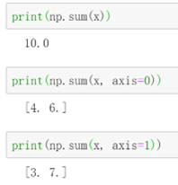

**上海海洋大学实验报告**

 

 

课程名称：   大数据技术课程设计            

 

实验名称：   大数据技术 Numpy实践             

 

学  院：   信息学院                 

 

专  业：   数据科学与大数据技术           

 

实验人学号： 2152234 姓名： 郭万祥  班级： 21数据1班 

 

实验时间： 2024/3/27                  

 

实验报告提交时间： 2024/3/27              


 

# 一、实验目的

掌握PySpark和numpy集成进行数据处理

# 二、实验平台

操作系统：Centos7

Python版本：3.4.3

# 三、实验内容和要求

##  

**按照上述流程完成实验过程，保存关键步骤截图，程序运行成功即可得满分。**

**（有提示，写完之后尽快交上次作业）**

### numpy 的array操作

#### 1.导入numpy库

```
 import numpy as np
```

#### 2.建立一个一维数组 a 初始化为[4,5,6], (1)输出a 的类型（type）(2)输出a的各维度的大小（shape）(3)输出 a的第一个元素（值为4）


#### 3.建立一个二维数组 b,初始化为 [ [4, 5, 6],[1, 2, 3]] (1)输出各维度的大小（shape）(2)输出 b(0,0)，b(0,1),b(1,1) 这三个元素（对应值分别为4,5,2）


#### 4. (1)建立一个全0矩阵 a, 大小为 3x3; 类型为整型（提示: dtype = int）(2)建立一个全1矩阵b,大小为4x5; (3)建立一个单位矩阵c ,大小为4x4; (4)生成一个随机数矩阵d,大小为 3x2.


#### 5. 建立一个数组 a,(值为[[1, 2, 3, 4], [5, 6, 7, 8], [9, 10, 11, 12]] ) ,(1)打印a; (2)输出 下标为(2,3),(0,0) 这两个数组元素的值


 

#### 6.把上一题的 a数组的 0到1行 2到3列，放到b里面去，（此处不需要从新建立a,直接调用即可）(1),输出b;(2) 输出b 的（0,0）这个元素的值


#### 7. 把第5题中数组a的最后两行所有元素放到 c中，（提示： a[1:2, :]）(1)输出 c ; (2) 输出 c 中第一行的最后一个元素（提示，使用 -1 表示最后一个元素）


#### 8.建立数组a,初始化a为[[1, 2], [3, 4], [5, 6]]，输出 （0,0）（1,1）（2,0）这三个元素（提示： 使用 print(a[[0, 1, 2], [0, 1, 0]]) ）


#### 9.建立矩阵a ,初始化为[[1, 2, 3], [4, 5, 6], [7, 8, 9], [10, 11, 12]]，输出(0,0),(1,2),(2,0),(3,1) (提示使用 b = np.array([0, 2, 0, 1]) print(a[np.arange(4), b]))


#### 10.对9 中输出的那四个元素，每个都加上10，然后重新输出矩阵a.(提示： a[np.arange(4), b] += 10 ）


### array 的数学运算

#### 11. 执行 x = np.array([1, 2])，然后输出 x 的数据类型


#### 12.执行 x = np.array([1.0, 2.0]) ，然后输出 x 的数据类类型


In [ ]:

```
 
```

#### 13.执行 x = np.array([[1, 2], [3, 4]], dtype=np.float64) ，y = np.array([[5, 6], [7, 8]], dtype=np.float64)，然后输出 x+y ,和 np.add(x,y)


#### 14. 利用 13题目中的x,y 输出 x-y 和 np.subtract(x,y)


#### 15. 利用13题目中的x，y 输出 x*y ,和 np.multiply(x, y) 还有 np.dot(x,y),比较差异。然后自己换一个不是方阵的试试。


#### 16. 利用13题目中的x,y,输出 x / y .(提示 ： 使用函数 np.divide())


#### 17. 利用13题目中的x,输出 x的 开方。(提示： 使用函数 np.sqrt() )


#### 18.利用13题目中的x,y ,执行 print(x.dot(y)) 和 print(np.dot(x,y))


##### 19.利用13题目中的 x,进行求和。提示：输出三种求和 (1)print(np.sum(x)): (2)print(np.sum(x，axis =0 )); (3)print(np.sum(x,axis = 1))



#### 20.利用13题目中的 x,进行求平均数（提示：输出三种平均数(1)print(np.mean(x)) (2)print(np.mean(x,axis = 0))(3) print(np.mean(x,axis =1))）


#### 21.利用13题目中的x，对x 进行矩阵转置，然后输出转置后的结果，（提示： x.T 表示对 x 的转置）


#### 22.利用13题目中的x,求e的指数（提示： 函数 np.exp()）


#### 23.利用13题目中的 x,求值最大的下标（提示(1)print(np.argmax(x)) ,(2) print(np.argmax(x, axis =0))(3)print(np.argmax(x),axis =1))

 

