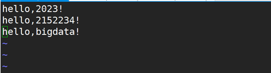
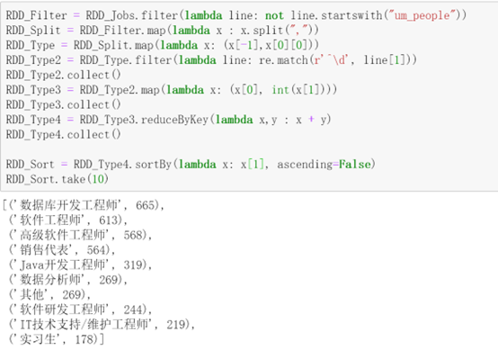

上海海洋大学信息学院

**《大数据原理与技术课程设计》****大作业**

 

 

专  业： 数据科学与大数据技术             

班  级： xxx              

学  号： 215xxx             

姓   名： xxx              

自 评 分： xxx            

 

 

 

 

 

2023年12月

 

 

**1.**  **完成以下操作，并截图（共10分）**

\1)  在terminal窗口中运行date命令和who命令。（1分）

\2)  启动Hadoop，并查看启动是否正常。（1分）

\3)  在HDFS系统的根目录下创建“2023/bigdata/你的学号”的子目录（例如学号为1234567，则目录为“2023/bigdata/1234567”），并查看是否创建成功。（1分）

\4)  进入到本登录用户的主目录下，显示当前工作目录，并在当前工作目录下创建子目录data21，并在data21目录下创建名字为你学号的的txt文件。（1分）

\5)  使用vim软件编辑4）题中的建好txt文件，并在文件中输入“hello,2023!”、和“hello,你的学号!”和“hello,bigdata!”，三行文本后保存退出，并将该文件设置只有所有者能读，其他所有用户都不能读写，也不能执行。（1分）

\6)  将上题中的txt文件上传到3）中建好的子目录中，并查看是否上传成功。（1分）

\7)  用hdfs命令显示刚刚上传到HDFS文件系统中的txt文件的内容。（1分）

\8)  通过网页（Web UI）查看HDFS系统中刚上传文件的块（block）信息。（1分）

\9)  删除3）中建好的子目录，并查看是否成功。（1分）

\10) 关闭Hadoop，并查看是否关闭成功。（1分）

 

**2.**  **完成以下操作，并截图（共10分）**

\1)  启动HBase，并查看启动是否成功。（1分）

\2)  启动到HBase交互式环境。（1分）

\3)  查看HBase中的所有表。（1分）

\4)  在HBase中创建如下结构的student表。（1分）

\5)  向student表插入如下表格中的，其中'10001'为行键（RowKey）。（2分）

\6)  查询student表的所有数据。（1分）

\7)  查询zhang的所有数据。（1分）

\8)  查询student表的computer成绩在90分以上的学生信息。（1分）

\9)  删除表student，并查看删除是否成功。（1分）

 

**3.**  **Hadoop****的MapReduce编程（10分）**

已知一电影评论的数据集存放在comments_data.csv中（在泛雅平台可以下载），数据格式数据集共7列。分别为：ID表示评论的ID号，TIME表示评论的时间，MOVIEID表示电影的ID号，RATING表示对电影的打分，取值范围为1~5的整数。CONTENT为评论的具体内容，CREATOR为评论的创建者，ADD_TIME表示摘取评论的时间。字段含义如下表所示：

| **字段名** | **含义**       |
| ---------- | -------------- |
| ID         | 评论ID号       |
| TIME       | 评论时间       |
| MOVIEID    | 电影ID号       |
| RATING     | 打分           |
| CONTENT    | 评论内容       |
| CREATOR    | 评论的创建者   |
| ADD_TIME   | 摘取评论的时间 |

请用MapReduce编程完成该数据集的清洗工作，具体要求如下：

\1.  清洗掉首行标题数据

\2.  清洗掉有缺失字段的行

\3.  保留MOVIEID、RATING、CONTENT

\4.  计算每个电影的平均分和所有评论内容（多个评论内容之间用“++&++”连接起来）

\5.  将清洗和处理完的数据以电影ID、平均打分和所有评论内容存储至HDFS的/test/results/ 目录下，字段之间用‘\t’分割

**要求：**

\1.  将文件上传到HDFS的‘/test/data/’目录下。（1分）

\2.  给出MapReduce程序源代码，关键行需要有注释说明。（5分）

package bigwork;

 

 

import org.apache.hadoop.conf.Configuration;

import org.apache.hadoop.fs.Path;

import org.apache.hadoop.io.NullWritable;

import org.apache.hadoop.io.Text;

import org.apache.hadoop.mapreduce.Job;

import org.apache.hadoop.mapreduce.lib.input.FileInputFormat;

import org.apache.hadoop.mapreduce.lib.output.FileOutputFormat;

 

import java.io.IOException;

 

public class MyDriver {

  public static void main(String[] args) throws IOException, InterruptedException, ClassNotFoundException {

​    // 1、获取job

​    Configuration conf = new Configuration();

 

​    Job job = Job.getInstance(conf);

 

​    // 2、设置jar包路径

​    job.setJarByClass(MyDriver.class);

 

​    // 3、关联mapper和reducer

​    job.setMapperClass(MyMapper.class);

​    job.setReducerClass(MyReducer.class);

 

​    // 4、设置map输出的kv类型

​    job.setMapOutputKeyClass(Text.class);

​    job.setMapOutputValueClass(Text.class);

 

​    // 5、设置最终的kv类型

​    job.setOutputKeyClass(Text.class);

​    job.setOutputValueClass(NullWritable.class);

 

//    job.setNumReduceTasks(0);   // 设置reduceTask的个数

 

​    // 6、设置输入路径和输出路径

​    FileInputFormat.setInputPaths(job, new Path("hdfs://hadoop102:8020/test/data/comments_data.csv"));

​    FileOutputFormat.setOutputPath(job, new Path("hdfs://hadoop102:8020/test/results"));

 

​    // 7、提交job

​    boolean result = job.waitForCompletion(true);

​    System.exit(result ? 0 : 1);

 

  }

 

}

 

package bigwork;

 

import org.apache.hadoop.io.LongWritable;

import org.apache.hadoop.io.Text;

import org.apache.hadoop.mapreduce.Mapper;

 

import java.io.IOException;

 

/**

 \* @author name 婉然从物

 \* @create 2023-12-25 10:12

 */

public class MyMapper extends Mapper<LongWritable, Text, Text, Text> {

  private Text OutK = new Text();

  private Text OutV= new Text();

 

  private int i = 0; // 定义变量用于统计读取数据进度到第几行

 

​    @Override

  protected void map(LongWritable key, Text value, Mapper<LongWritable, Text, Text, Text>.Context context) throws IOException, InterruptedException {

​    // TODO 1. 获取一行

​    String line = value.toString();

 

​    i++;  // 用于统计读取数据进度到第几行

 

​    // TODO 2. ETL

​    boolean result = judge(line, context); // 该方法用于清洗掉脏数据

 

​    if (!result){  // 若清洗数据的方法返回结果是false， 则直接读取下一行， 过滤掉当前行

​      return;

​    }

 

​    // TODO 3. 写出到reduce端

​    context.write(OutK, OutV);

 

  }

 

  /**

   \* 定义map清洗数据的方法

   \* @param line 读取到的当前行数据

   \* @param context

   \* @return false表示脏数据

   */

  private boolean judge(String line, Context context) {

​    String[] words = line.split(",");

 

​    // 空白行需要过滤

​    if (line.isEmpty()){

​      return false;

​    }

 

​    // 数据长度不是7， 需要过滤

​    if (words.length != 7){

​      return false;

​    }

 

​    // 第一行需要过滤

​    if (i == 1){

​      return false;

​    }

 

​    // 匹配一行开头为任意个数字的ID， 过滤掉不是以数字开头的行

​    String regex = "\\d*";

​    if (!words[0].matches(regex)){

​      return false;

​    }

 

​    // 过滤掉第四列数据只是负号， 没有数据的列

​    if (words[3].equals("-")){

​      return false;

​    }

 

​    OutK.set(words[2]);   // 将第三列，即MOVIEID作为map端输出的key

​    OutV.set(words[3] + "\t" + words[4]);  // 将RATING、CONTENT列作为map端输出的value, 中间以制表符连接

 

​    return true;  // 当前数据没有被过滤， 执行接下来的操作

  }

}

 

package bigwork;

 

import org.apache.hadoop.io.NullWritable;

import org.apache.hadoop.io.Text;

import org.apache.hadoop.mapreduce.Reducer;

 

import java.io.IOException;

import java.util.ArrayList;

 

/**

 \* @author name 婉然从物

 \* @create 2023-12-25 11:31

 */

  public class MyReducer extends Reducer<Text, Text, String, NullWritable> {

 

 

  private String OutK;

 

  private Double avgRound;

 

  @Override

  protected void reduce(Text key, Iterable<Text> values, Reducer<Text, Text, String, NullWritable>.Context context) throws IOException, InterruptedException {

 

​    Integer count = 0; // 每个电影出现了多少次

 

​    Double sum = 0.0;  // 电影总的评分

 

​    Double avg = 0.0;  // 电影平均评分

 

​    String contents = null;

 

 

​    ArrayList<Double> rating = new ArrayList<>();  // 定义集合用来存储电影评分

 

​    ArrayList<String> content = new ArrayList<>(); // 定义集合用来存储电影评论

 

 

​    for (Text value : values) { //   遍历Text对象

 

​      String[] lines = value.toString().split("\t");  // 将Text对象转化成字符串再进行切割

 

​      // 切割后的数组， 第一个索引表示电影评分 第二个索引表示电影评论

​      rating.add(Double.parseDouble(lines[0]));  // 将字符串类型的电影评分转化为Double类型

 

​      String result = null;  // 定义变量， 用于承接去掉首末6个引号的电影评论lines[1]

 

​      if (lines[1].length() > 6){   // 若电影评论加6个引号大于6， 则将首末引号过滤

​        result = lines[1].substring(3, lines[1].length() - 3); // 截取字符串， 去掉首末6个引号

​      } else {

​        result = lines[1];   // 若电影评论加6个引号小于6， 则不处理该评论

​      }

 

​      content.add(result);    // 将评论内容添加到content集合

​    }

 

 

​    for (Double rat : rating) {   // 遍历评分  rating集合

​      sum+=rat;          // 将遍历到的集合相加， 赋值给sum

​      count++;          // count用于计数，  该电影评分数目

​    }

 

​    int tmp = 0;  // 定义临时遍历tmp， 用于判断电影评论是否为第一行

 

​    for (String cont : content) {  // 遍历电影评论集合content

​      if(tmp == 0){        // 表示是该电影第一行评论

​        contents = cont;    // 这个电影的第一条电影直接复制给字符串contents

​        tmp = 1;        // 将tmp设置为1， 表示接下来循环中的电影评论都不是第一条

​      } else {

​        contents = contents + "++&++" + cont;  // 从第二条电影评论开始， 前面添加++&++，

​                            // 并连接到字符串contents

​      }

​    }

 

 

​    avg = sum / count;   // 计算电影评分平均值

 

​    avgRound = Math.round(avg * 10.0) / 10.0 ;   // 将评分平均值四舍五入， 并保留一位小数

 

​    // 将MOVIEID、平均评分、所有评论  作为reduce端输出的主键，

​    OutK = key.toString() + "\t" + OutK + "\t" + contents;

 

​    // TODO 写出

​    context.write(OutK, null);

  }

 

}

\3.  给出运行后，运行命令查看/test/results/目录下的输出内容。（1分）

\4.  给出运行后，运行命令查看输出结果文件的前5行和后5行。（2分）

\5.  利用HDFS命令将输出的结果文件下载到本地主目录下。（1分）

 

**4.**  **已知“earthquake_data.csv”文件中存放的是全球近30天的地震数据，其中文件内容格式如下图。图中显示的是文件的前3行内容，第1行为数据字段标题。具体字段的含义可参考网站：**

**https://earthquake.usgs.gov/earthquakes/feed/v1.0/csv.php****。**

**要求：**

用Spark RDD的编程，统计该文件中地震数位于前3的日期。请补充完整如下代码。（每步1分，共10分）

 

\# 1）通过读earthquake_data.csv文件形成RDD1。

RDD1 = sc.textFile("hdfs://hadoop102:8020/test/data/earthquake_data.csv")

\# 2）显示RDD1的前2条记录。

RDD1.take(2)

\# 3）利用RDD变换，过滤掉数据中的第一行标题数据。

RDD1 = RDD1.filter(lambda line: not line.startswith("time"))

\# 4）将RDD1持久化到内存。

RDD1.persist()

\# 5）将RDD1进行变换，分割出一行上的每个数据字段，形成新的RDD2。

RDD2 = RDD1.map(lambda x : x.split(","))

\# 6）对RDD2进行变换，形成元素为（日期，1）的这种格式的二元组内容的RDD3。

RDD3 = RDD2.map(lambda x : (x[0][:10] ,1))

\# 7）对RDD3按日期进行统计，即统计每个日期总的地震发生次数，形成新的RDD4。

RDD4 = RDD3.reduceByKey(lambda x,y: x + y)

\# 8）对RDD4对里面的元素按地震次数按降序排序，形成新的RDD5。

RDD5 = RDD4.sortBy(lambda x: x[1], ascending = False)

\# 9）取出RDD5中的前3个元素，赋给python 的list类型变量result。

result = RDD5.take(3)

\# 10）利用for循环取出result中的每个元素，显示日期和地震总次数。

for i in result:

  print(i)

**5.**  **已知“jobs.txt”文件中存放的是通过网络爬虫采集到的有关工作岗位的招聘数据，第一行为字段名，后面行是数据。（10分）**

**要求：**

在Jupyter Notebook中，用Spark RDD编程实现如下功能。

\1)  公司性质及其数量分布

RDD_Jobs = sc.textFile("hdfs://hadoop102:8020/test/data/jobs.csv")

RDD_Jobs.take(3)

RDD_Filter = RDD_Jobs.filter(lambda line: not line.startswith("um_people"))

RDD_Split = RDD_Filter.map(lambda x : x.split(","))

RDD_Type = RDD_Split.map(lambda x: (x[3],1))

RDD_Type = RDD_Type.filter(lambda line: line[0]!='')

RDD_Type_Sum = RDD_Type.reduceByKey(lambda x, y : x + y)

RDD_Type_Sum.collect()

\2)  经验要求及其数量分布

RDD_Jobs.take(3)

RDD_Filter = RDD_Jobs.filter(lambda line: not line.startswith("um_people"))

RDD_Split = RDD_Filter.map(lambda x : x.split(","))

RDD_Type = RDD_Split.map(lambda x: (x[-2],1))

RDD_Type_Sum = RDD_Type.reduceByKey(lambda x, y : x + y)

RDD_Sort = RDD_Type_Sum.sortBy(lambda x: x[1], ascending=False)

RDD_Sort.collect()

\3)  公司规模及其数量分布

RDD_Jobs.take(3)

RDD_Filter = RDD_Jobs.filter(lambda line: not line.startswith("um_people"))

RDD_Split = RDD_Filter.map(lambda x : x.split(","))

RDD_Type = RDD_Split.map(lambda x: (x[6],1))

RDD_Type_Sum = RDD_Type.reduceByKey(lambda x, y : x + y)

RDD_Sort = RDD_Type_Sum.sortBy(lambda x: x[1], ascending=False)

RDD_Sort.collect()

\4)  需求量前10的工作岗位类别

RDD_Filter = RDD_Jobs.filter(lambda line: not line.startswith("um_people"))

RDD_Split = RDD_Filter.map(lambda x : x.split(","))

RDD_Split = RDD_Split.filter(lambda x : len(x) == 16)

 

RDD_Type = RDD_Split.map(lambda x: (x[-1],1))

 

RDD_Type = RDD_Type.reduceByKey(lambda x,y : x + y)

RDD_Type = RDD_Type.sortBy(lambda x:x[1], ascending=False)

RDD_Type.take(10)

\5)  工作地为上海的大数据工资情况分布

RDD_Filter = RDD_Jobs.filter(lambda line: not line.startswith("um_people"))

RDD_Split = RDD_Filter.map(lambda x : x.split(","))

RDD_Type = RDD_Split.map(lambda x: (x[-7], x[-4], x[-8]))

RDD_Type.take(10)

RDD_Shanghai = RDD_Type.filter(lambda x: "上海" in x[0] and "大数据" in x[2])

RDD_Shanghai = RDD_Shanghai.map(lambda x: (x[1], 1)).reduceByKey(lambda x,y: x+y).sortBy(lambda x: x[1], ascending=False)

RDD_Shanghai.collect()

\6)  各城市（工作地为北京、上海、广州和深圳）对大数据岗位需求量分布

RDD_Filter = RDD_Jobs.filter(lambda line: not line.startswith("um_people"))

RDD_Split = RDD_Filter.map(lambda x: x.split(","))

RDD_Type = RDD_Split.map(lambda x: (x[-7], x[-8]))

RDD_Type2 = RDD_Type.filter(lambda line: "大数据" in line[1])

RDD_Type2.collect()

 

RDD_Type3 = RDD_Type2.map(lambda x: (x[0], 1)).reduceByKey(lambda x,y: x+y)

RDD_TypeNew = RDD_Type3.filter(lambda x: x[0] in ["北京","上海","广州","深圳"])

RDD_TypeNew.collect()

 

RDD_Type4 = RDD_Type3.filter(lambda x: "北京-" in x[0])

RDD_Type5 = RDD_Type4.map(lambda x: (("北京"),x[1]))

RDD_Type6 = RDD_Type5.reduceByKey(lambda x,y: x+y)

 

RDD_Type4 = RDD_Type3.filter(lambda x: "上海-" in x[0])

RDD_Type5 = RDD_Type4.map(lambda x: (("上海"),x[1]))

RDD_Type7 = RDD_Type5.reduceByKey(lambda x,y: x+y)

 

RDD_Type4 = RDD_Type3.filter(lambda x: "广州-" in x[0])

RDD_Type5 = RDD_Type4.map(lambda x: (("广州"),x[1]))

RDD_Type8 = RDD_Type5.reduceByKey(lambda x,y: x+y)

 

RDD_Type4 = RDD_Type3.filter(lambda x: "深圳-" in x[0])

RDD_Type5 = RDD_Type4.map(lambda x: (("深圳"),x[1]))

RDD_Type9 = RDD_Type5.reduceByKey(lambda x,y: x+y)

 

RDD_TypeNew2 = RDD_TypeNew.union(RDD_Type7).union(RDD_Type8).union(RDD_Type9)

 

RDD_TypeNew2.reduceByKey(lambda x,y: x+y).collect()

 

**6.**  **代码分析与设计优化（共10分）**

（1）.已知一文本文件‘books.txt’里面包含书籍的信息，请分析以下代码，回答如下问题：（6分）

\1)  该代码运行时，会产生几个Job，每个Job会有几个Stage，每个Stage会执行多少Task，为什么？

答：该代码运行时，会产生1个Job，每个Job会有3个Stage，每个Stage会执行若干个Task。

每个Job产生3个Stage的原因是因为在执行reduceByKey操作时，Spark会自动将其拆分为一个Shuffle阶段。除此之外，其他的操作都是在同一个Stage中完成的。

 

每个Stage会执行若干个Task的原因是因为在Spark中，数据被分片(partition)，每个分片称为一个Task。根据数据的大小和集群的配置，可能会有多个Task来处理一个分片。

 

\2)  代码中哪些代码会在Driver端执行，哪些会在Worker端执行？

答：代码中sc.textFile和rdd.first会在Driver端执行。

其余的操作如rdd.filter, rdd.map, rdd.reduceByKey, rdd.filter和rdd.collect会在Worker端执行。

 

\3)  代码是否存在可以优化的地方？如有，如何优化，并说明你优化的依据。

答：使用Spark DataFrame代替RDD，因为DataFrame在处理结构化数据时更加高效。

减少使用collect操作，因为collect会将所有数据都拉取到Driver端，这可能会造成内存溢出。可以改用其他方法来查看数据。

 

from pyspark import SparkContext, SparkConf

conf = SparkConf().setAppName('appName').setMaster('Local[4]')

sc = SparkContext.getOrCreate(conf)

 

rdd = sc.textFile('books.txt',4)

first= rdd.first()

rdd1 = rdd.filter(lambda x: x!=first)

rdd2 = rdd1.map(lambda line: line.split('\t'))

rdd3 = rdd2.map(lambda x:(x[1],1))

rdd4 = rdd3.reduceByKey(lambda x,y: x+y)

rdd5 = rdd4.filter(lambda x: x[1] != 1)

res = rdd5.collect()

print(res)

 

（2）.已知某药店在一个文本文件‘test.txt’中存放了一些药品信息，现需要对部分药品（见下面的‘需要调价的药品名称列表’）进行调价，调价原则为上涨20%。

要求用Spark编程实现调价，并将结果存放到一个文本文件中（价格保留整数），文件名为你的学号，后缀为txt，文件存放位置任意。希望你尽可能给出优化的代码和代码的详细注释，以及保存好结果的截图。（4分）

 

其中test.txt中药品信息格式如下，字段间以tab键‘\t’分割：

id name  price

1 柴胡注射液 85

2 感冒清片（胶囊）  64

3 感冒清热颗粒  85

...

 

需要调价的药品名称列表：

感冒清热颗粒

牛黄清感胶囊

双黄连口服液

重感灵片（胶囊）

RDD1 = sc.textFile("hdfs://hadoop102:8020/test/data/test.txt") # 读取药品数据

 \# 先由split将数据按"\t"切割， 接着将分割后的一行数据合并成整体, 过滤掉首行

RDD2 = RDD1.map(lambda x: x.split("\t")).map(lambda x: (x[0], x[1], x[2])).filter(lambda x: x[0]!="id")

 

 \# 先由split将数据按"\t"切割， 接着将分割后的一行数据合并成整体, 只保留第一行

RDD_ID = RDD1.map(lambda x: x.split("\t")).map(lambda x: (x[0], x[1], x[2])).filter(lambda x: x[0]=="id")

 

\# 将需要涨价的药品乘以1.2，其他不变 并将RDD3第三列数据全部转化为float类型

RDD3 = RDD2.map(lambda x: (x[0], x[1], float(x[2])*1.20

​              if x[1] in ["感冒清热颗粒", "牛黄清感胶囊", "双黄连口服液", "重感灵片（胶囊）"] else float(x[2])))

 

\# 将RDD3第三列数据四舍五入变成整数

RDD4 = RDD3.map(lambda x: (x[0], x[1], round(float((x[2])))))

 

\# 将RDD_ID和RDD4合并， 形成RDD5

RDD5 = RDD_ID.union(RDD4)

 

\# 收集打印RDD5， 输出最后结果

RDD5.collect()

 

 

**7.**  **课程实验与大作业的心得体会（不少于300字）**

主要描述在课程实验和大作业完成过程中遇到的主要问题与解决过程，收获和体会。

主要问题与解决过程：

1） 在启动hbase之后，总是显示数据正在初始化，输入命令无法执行。通过查阅博客，修改了hbase配置文件，不见效果。最后发现是hbase的HMaster结点总是自动挂断，hdfs的某些结点也会挂断。通过查看可用内存和磁盘才发现是磁盘已满。最后删除了所有压缩包。问题解决。

2） 在编程mapreduce阶段，首先是切割.csv文件时分隔符和文件数据中的逗号冲突问题。先用pandas读取文件，定义函数匿名将评论列加上引号。数据清洗结束后，在reduce阶段用substring方法截取除去引号之外的内容，解决该问题。

3） 还是在编程mapreduce阶段，清洗数据最后结果总是和预期不符，通过将代码多次debug，最后发现数据集需要清洗的细节，加上清洗条件，最终顺利解决问题。

收获和体会：

更加熟悉了hadoop,hbase的基本操作以及mapreduce运行原理。加深了对spark底层原理和RDD的了解。熟悉了RDD的基本api用法，提高了spark编程技能。